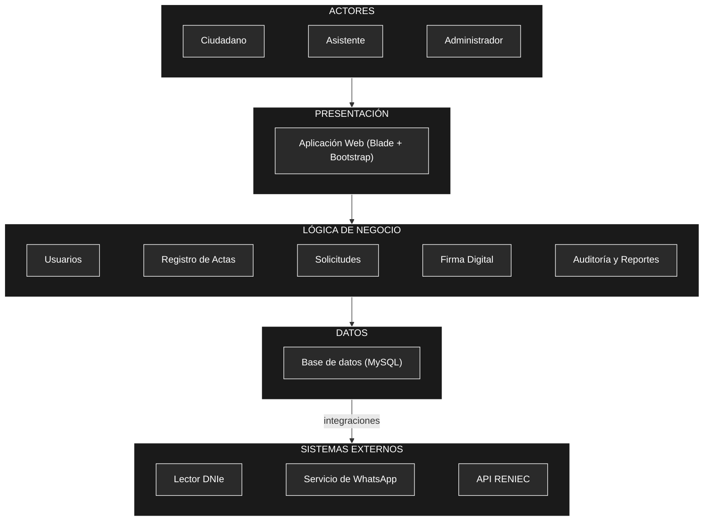

# Arquitectura inicial del sistema

## Diagrama de arquitectura

## Descripción

La arquitectura inicial se organiza en tres capas principales:

- **Presentación:** Permite la interacción de los usuarios (Ciudadano, Asistente y Administrador) con el sistema mediante la aplicación web desarrollada en Blade y Bootstrap.
- **Lógica de negocio:** Contiene los principales módulos responsables de las funcionalidades del sistema: usuarios, registro de actas (nacimiento, matrimonio, defunción), solicitudes, firma digital con DNIe, y auditoría con reportes.
- **Datos:** Permite almacenar y consultar la información mediante una base de datos MySQL y el repositorio de almacenamiento de archivos.

- **Sistemas externos:** Además, el sistema se integra con componentes externos como el Lector DNIe para la firma digital, el servicio de 
      notificaciones por WhatsApp y la API de RENIEC para la consulta y validación de datos.
